# MonoForce: Learnable Image-conditioned Physics Engine

[](https://arxiv.org/abs/2502.10156)
[](https://ieeexplore.ieee.org/abstract/document/10801353)
[](https://arxiv.org/abs/2309.09007)
[](https://differentiable.xyz/papers-2024/paper_30.pdf)

[](https://drive.google.com/file/d/1XP0o5xvUlE1_pGOX9tKGPCKOJVdANM_H/view?usp=sharing)
[](https://drive.google.com/file/d/1tTt1Oi5k1jKPDYn3CnzArhV3NPSNxKvD/view?usp=sharing)
[](https://docs.google.com/presentation/d/1A9yT6MC-B9DdzMdzCZ44Y8nVHtBHWxpLAUOZKS_GUcU/edit?usp=sharing)
[](https://drive.google.com/drive/folders/1nli-4YExqcBhl0mPNRUjSiNecX4yIcme?usp=sharing)

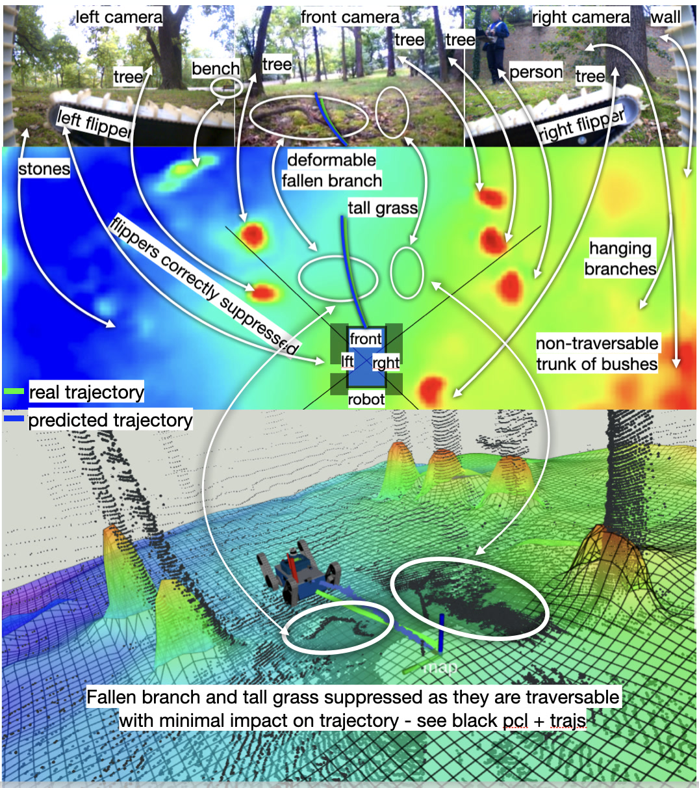

Robot-terrain interaction prediction from RGB camera images as input:
- predicted trajectory,
- terrain shape and properties,
- interaction forces and contacts.

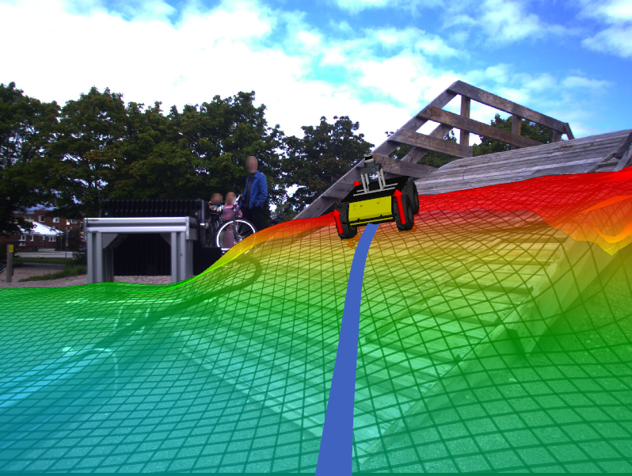 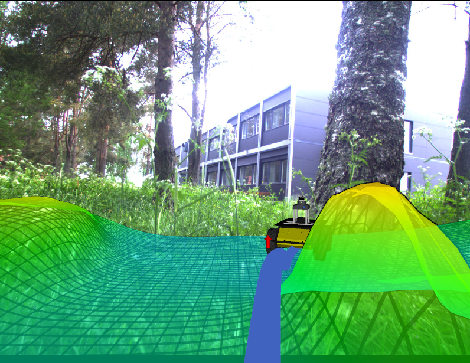 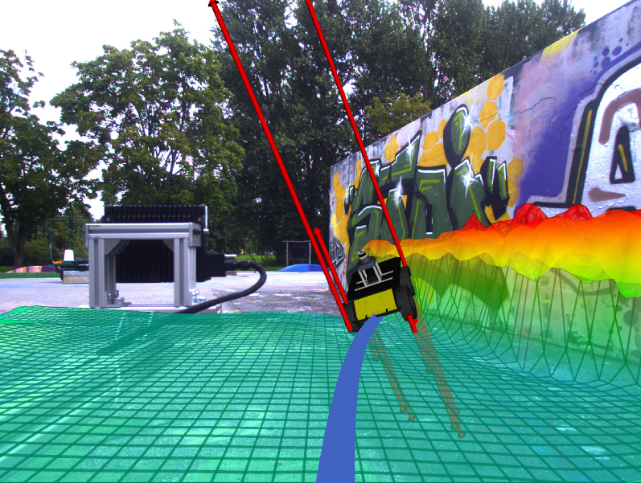 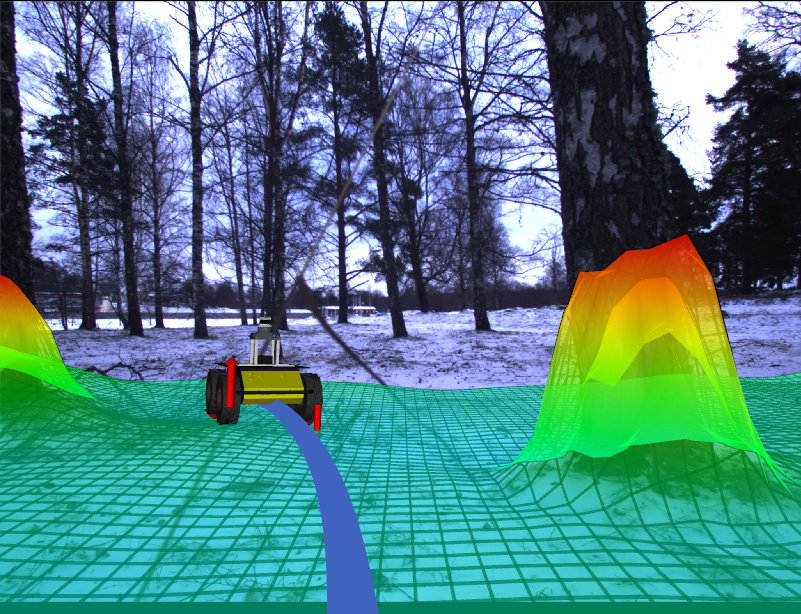

Examples of predicted trajectories and autonomous traversal through vegetation:

<p>
  <a href="https://www.youtube.com/watch?v=JGi-OzTBG1k">
    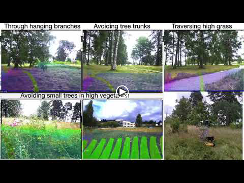
  </a>
  <a href="https://drive.google.com/file/d/1TTNTyqZnObtdE_PdCc2GprszphnE3hxS/view?usp=drive_link">
    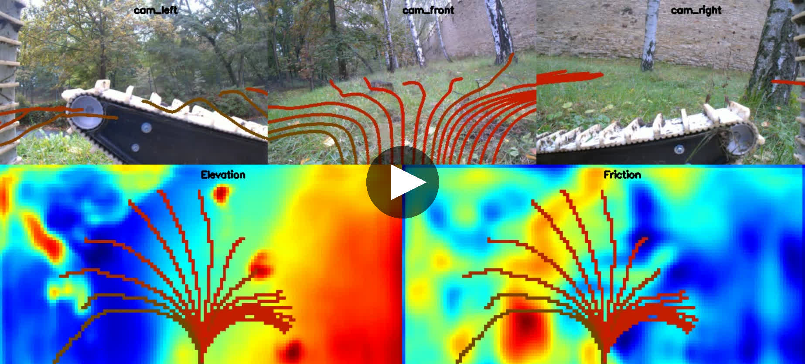
  </a>
</p>

## Table of Contents
- [Installation Instructions](./monoforce/docs/INSTALL.md)
- [Data](./monoforce/docs/DATA.md)
- [Terrain Encoder](./monoforce/docs/TERRAIN_ENCODER.md)
- [Differentiable Physics Engine](./monoforce/docs/DPHYS.md)
- [Running](#running)
- [Examples](./monoforce/examples)
- [ROS Integration](#ros-integration)
- [Training](#training)
- [Navigation](#navigation)
- [Citation](#citation)

## Running

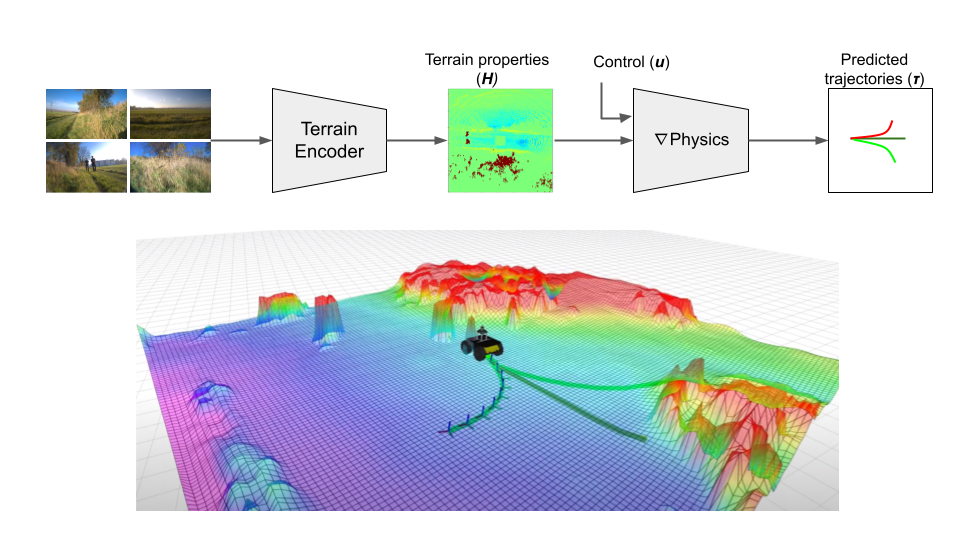

The MonoForce pipeline consists of the Terrain Encoder and the Physics Engine.
Given input RGB images and cameras calibration the Terrain Encoder predicts terrain properties.
Then the differentiable Physics Engine simulates robot trajectory and interaction forces on the predicted terrain
for a provided control sequence.
Refer to the [monoforce/examples](./monoforce/examples) folder for implementation details.

Please run the following command to explore the MonoForce pipeline:
```commandline
cd monoforce/
python scripts/run.py --img-paths IMG1_PATH IMG2_PATH ... IMGN_PATH --cameras CAM1 CAM2 ... CAMN --calibration-path CALIB_PATH
```

For example if you want to test the model with the provided images from the
[ROUGH](https://github.com/ctu-vras/rough-dataset) dataset:
```commandline
cd monoforce/scripts/
./run.sh
```
Please, refer to the [installation instructions](./monoforce/docs/INSTALL.md#model-weights) to download the pre-trained model weights.

## ROS Integration


We provide a ROS nodes for both the trained Terrain Encoder model and the Differentiable Physics module.
They are integrated into the launch file:

```commandline
roslaunch monoforce monoforce.launch
```

## Training

The following terrain properties are predicted by the model:
- **Elevation**: the terrain shape.
- **Friction**: the friction coefficient between the robot and the terrain.
- **Stiffness**: the terrain stiffness.
- **Damping**: the terrain damping.

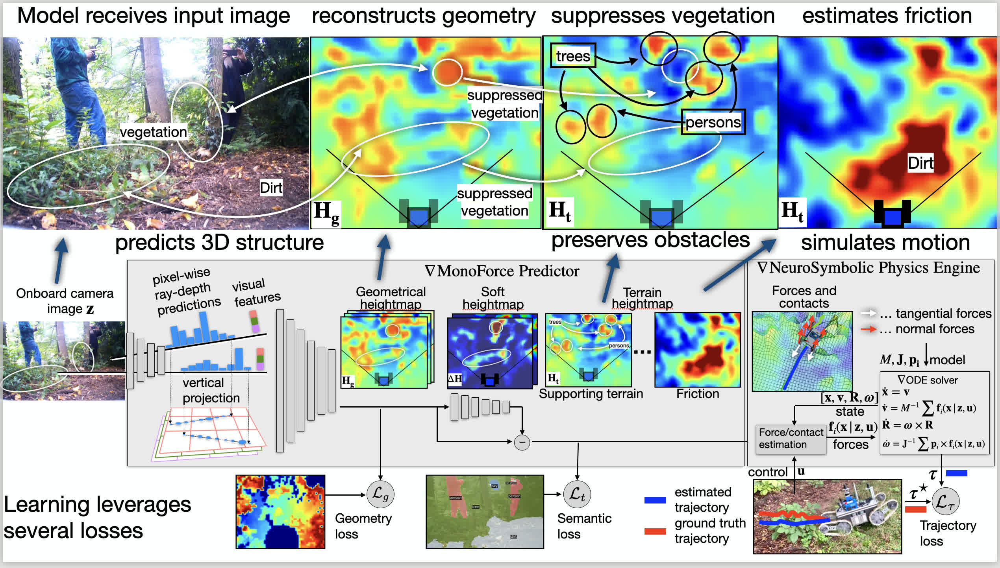

An example of the predicted elevation and friction maps (projected to camera images):
<p>
  <a href="https://drive.google.com/file/d/15Uo82hwE_OiRHsuGd0-9qcvrYOXsosn0/view?usp=drive_link">
  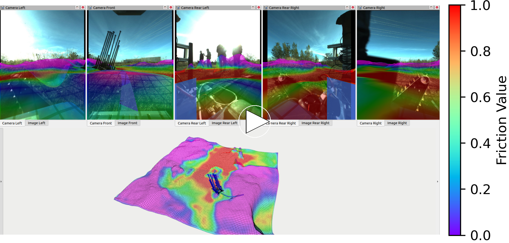
  </a>
</p>
One can see that the model predicts the friction map with
higher values for road areas and with the smaller value
for grass where the robot could have less traction.

To train the model, please run:
```commandline
cd monoforce/scripts/
python train.py
```

Please refer to the
[train_friction_head_with_pretrained_terrain_encoder.ipynb](./monoforce/examples/train_friction_head_with_pretrained_terrain_encoder.ipynb)
notebook for the example of the terrain properties learning
with the pretrained Terrain Encoder model and differentiable physics loss.

## Navigation

Navigation method with MonoForce predicting terrain properties
and possible robot trajectories from RGB images and control inputs.
The package is used as robot-terrain interaction and path planning pipeline.

<p>
  <a href="https://drive.google.com/file/d/1mqKEh_3VHZo4kDcJXP572SD1BVw37hSf/view?usp=drive_link">
  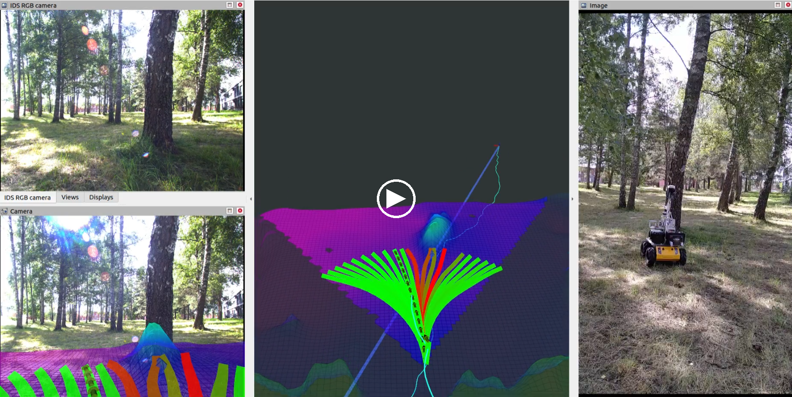
  </a>
</p>

We provide the differentiable physics model for robot-terrain interaction prediction:
- **Pytorch**: The model is implemented in Pytorch. Please refer to the
[diff_physics.ipynb](./monoforce/examples/diff_physics.ipynb)
notebook for the example of the trajectory prediction.

Navigation consists of the following stages:
- **Terrain prediction**: The Terrain Encoder is used to estimate terrain properties.
- **Trajectories simulation**: The Physics Engine is used to shoot the robot trajectories.
- **Trajectory selection**: The trajectory with the smallest cost based on robot-terrain interaction forces is selected.
- **Control**: The robot is controlled to follow the selected trajectory.

## Citation

Consider citing the papers if you find the work relevant to your research:

```bibtex
@inproceedings{agishev2024monoforce,
    title={MonoForce: Self-supervised Learning of Physics-informed Model for Predicting Robot-terrain Interaction},
    author={Ruslan Agishev and Karel Zimmermann and Vladimír Kubelka and Martin Pecka and Tomáš Svoboda},
    booktitle={IEEE/RSJ International Conference on Intelligent Robots and Systems - IROS},
    year={2024},
    eprint={2309.09007},
    archivePrefix={arXiv},
    primaryClass={cs.RO},
    url={https://arxiv.org/abs/2309.09007},
    doi={10.1109/IROS58592.2024.10801353},
}
```

```bibtex
@inproceedings{agishev2024endtoend,
    title={End-to-end Differentiable Model of Robot-terrain Interactions},
    author={Ruslan Agishev and Vladim{\'\i}r Kubelka and Martin Pecka and Tomas Svoboda and Karel Zimmermann},
    booktitle={ICML 2024 Workshop on Differentiable Almost Everything: Differentiable Relaxations, Algorithms, Operators, and Simulators},
    year={2024},
    url={https://openreview.net/forum?id=XuVysF8Aon}
}
```
