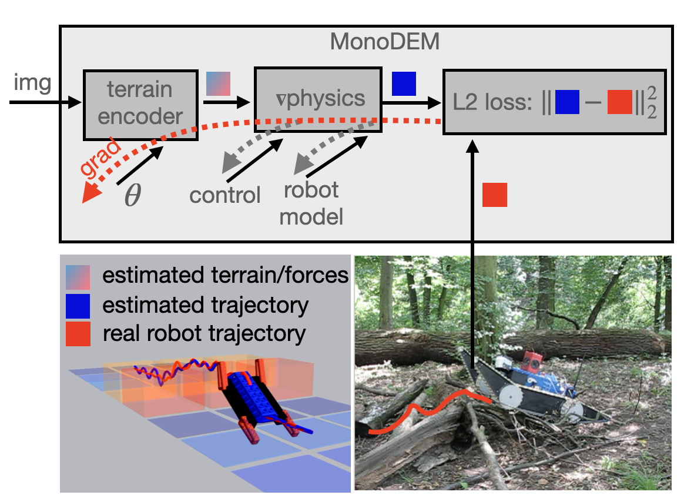
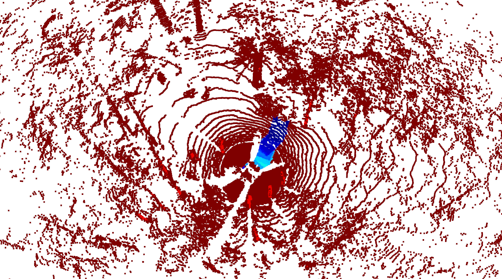
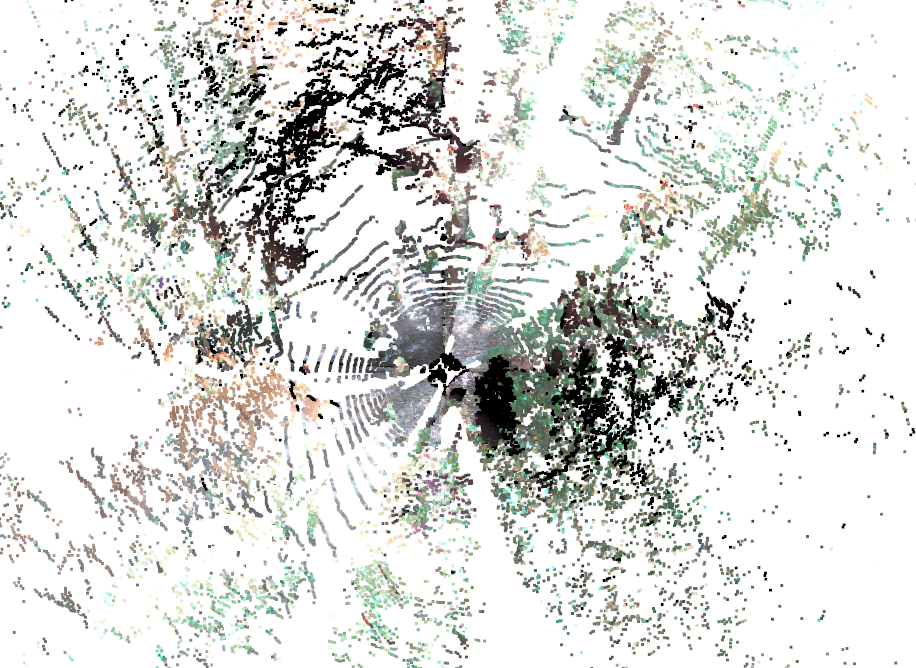
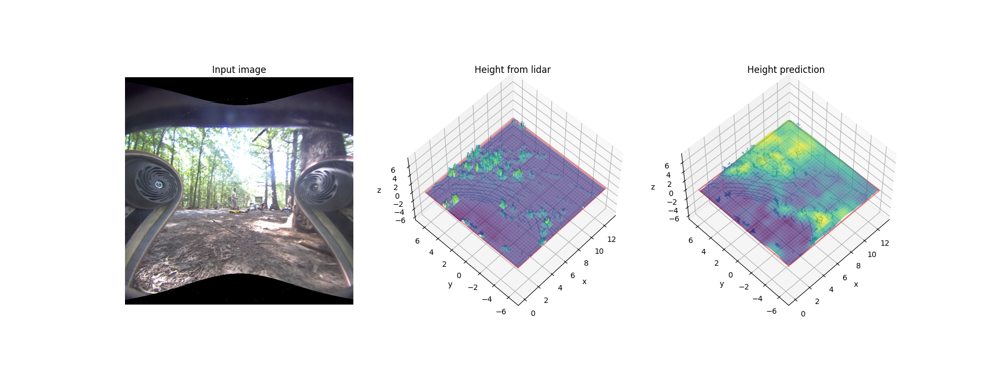
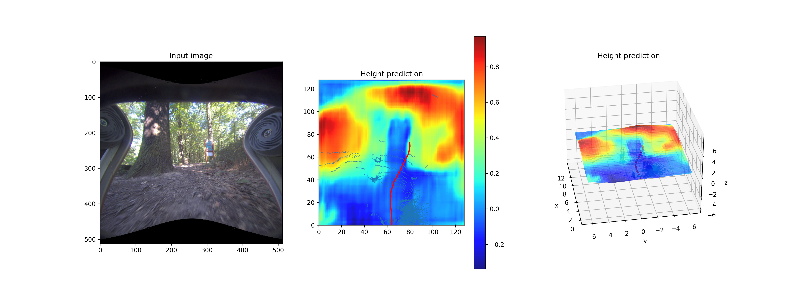

# MonoForce
Self-supervised learning of physics-aware grey-box model for predicting robot-terrain interaction.

[](https://arxiv.org/abs/2309.09007)

 


## Installation
Prerequisites:
- [pytorch](https://pytorch.org/) for differentiable physics simulation and models training.
- [mayavi](https://docs.enthought.com/mayavi/mayavi/) for data visualization.
- [ROS](http://wiki.ros.org/ROS/Installation) for data processing, and package integration.

Please clone and build the ROS package:
```commandline
mkdir -p ~/catkin_ws/src/
cd ~/catkin_ws/src/ && git clone https://github.com/ctu-vras/monoforce.git
cd ~/catkin_ws/ && catkin_make
```

## Dataset
The data is available at 
[http://subtdata.felk.cvut.cz/robingas/data/](http://subtdata.felk.cvut.cz/robingas/data/).

- Semi-supervised traversability data generated using lidar odometry and IMU.
- The dataset additionally contains:
  - camera images,
  - calibration data,
  - and RGB colors projected from cameras onto the point clouds.

The traversability dataset has the following structure:
```commandline
<experiment-date-place>
└── <robot name>
    └── <sequence name>_trav/
        ├── calibration
        │   ├── cameras
        │   ├── img_statistics.yaml
        |   └── transformations.yaml
        ├── cloud_colors
        ├── clouds
        ├── images
        ├── trajectories
        └── traj_poses.csv
```
Folders names example:
[22-08-12-cimicky_haj/marv/ugv_2022-08-12-15-18-34_trav/](http://subtdata.felk.cvut.cz/robingas/data/22-08-12-cimicky_haj/marv/ugv_2022-08-12-15-18-34_trav/).
One can download a sequence folder by running:
```commandline
scp -r <username>@subtdata.felk.cvut.cz:/data/robingas/data/<experiment-date-place>/<robot-name>/<sequence-name>_trav/ .
```



The semi-supervised data is stored in the `clouds` folder.
The point clouds traversed by a robot are labeled with the recorded onboard IMU measurements.
Please have a look at the
[video](https://drive.google.com/file/d/1CmLwgTUFmKrMXm5hG5n1Bz0XBZqLNifc/view?usp=drive_link)
for the data preview from a sequence recorded with a tracked robot in a forest environment.

In order to generate the traversability data from a prerecorded bag file, please run
(*note, that the topic names could be different depending on a bag file):
```commandline
cd ./scripts/data/
./save_clouds_and_trajectories_from_bag --bag-paths /path/to/dataset/<experiment-date-place>/<robot-name>/<sequence-name>.bag \
                                                    /path/to/dataset/<experiment-date-place>/<robot-name>/<sequence-name>_loc.bag \
                                                    --cloud-topics /os_cloud_node/destaggered_points \
                                                    --imu-topics /imu/data \
                                                    --robot-model 'Box()' --discard-model 'Box()' \
                                                    --input-step 50 --visualize False --save-data True
```

To obtain camera-lidar calibration data from a bag file and to project RGB colors from cameras onto the point clouds,
please run:
```commandline
cd ./scripts/data/
./add_calibrations_colors --bag-path /path/to/dataset/<experiment-date-place>/<robot-name>/<sequence-name>.bag \
                                     --lidar-topic /os_cloud_node/destaggered_points \
                                     --camera-topics /camera_fisheye_rear/image_color/compressed \
                                                     /camera_fisheye_front/image_color/compressed \
                                                     /camera_right/image_color/compressed \
                                                     /camera_left/image_color/compressed \
                                                     /camera_up/image_color/compressed \
                                     --camera-info-topics /camera_fisheye_front/camera_info \
                                                         /camera_fisheye_rear/camera_info \
                                                         /camera_right/camera_info \
                                                         /camera_left/camera_info \
                                                         /camera_up/camera_info \
                                     --visualize False --save-data True
```

Camera views examples:

Colored point cloud            |            Front-facing camera            |        Up-facing camera        
:-----------------------------:|:-----------------------------------------:|:------------------------------:
 |  | 

To explore the data, please run:
```commandline
python -m monoforce.datasets.robingas_dataset
```

## Differentiable Physics

Run the differentiable physics simulation with a tracked robot using the collected dataset:
```commandline
cd ./scripts/
./robot_control
```

[//]: # (TODO: expand the documentation by introducing a training pipeline scheme.)
Height map (and/or its properties) learning from the ground-truth trajectories followed by the robot:
```commandline
cd ./scripts/
./fit_terrain
```

## Terrain shape Prediction

1. Using the Differentiable Physics module, the terrain shape under the robot trajectory is optimized in order to match the ground-truth trajectory as closely as possible.
2. The optimized terrain shape is used as a label to train the terrain shape predictor. This model takes as input an RGB-image and predicts the shape of the supporting terrain in front of a robot.
In our experiments, we utilize the [Monolayout](https://github.com/manila95/monolayout) model.
3. Lidar scans are used in order to provide height map estimates serving as a regularization factor during training.

An example of a trained model output is given bellow.





## Citation

Consider citing the paper if you find it useful for your research:

```bibtex
@article{agishev2023monoforce,
  title={MonoForce: Self-supervised learning of physics-aware grey-box model for predicting the robot-terrain interaction},
  author={Agishev, Ruslan and Zimmermann, Karel and Pecka, Martin and Svoboda, Tom{\'a}{\v{s}}},
  journal={arXiv preprint arXiv:2309.09007},
  year={2023}
}
```
