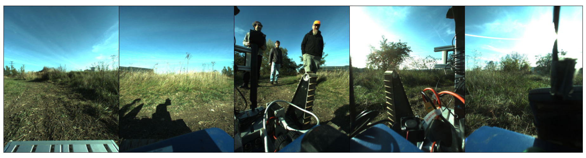
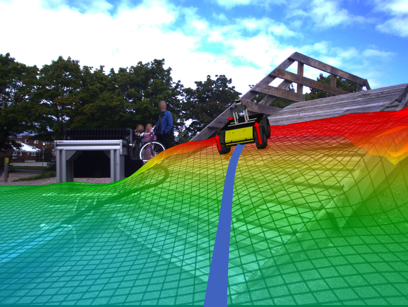
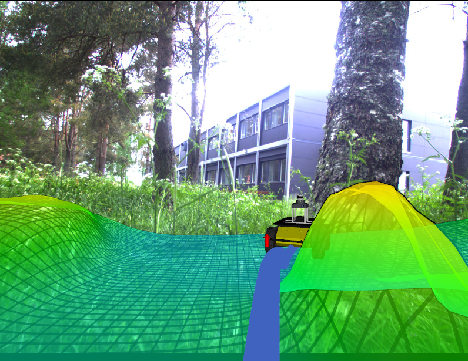
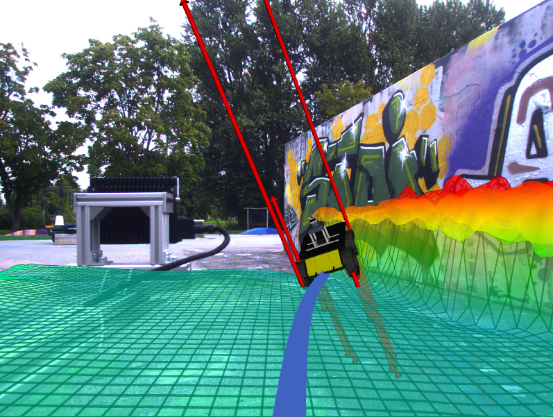
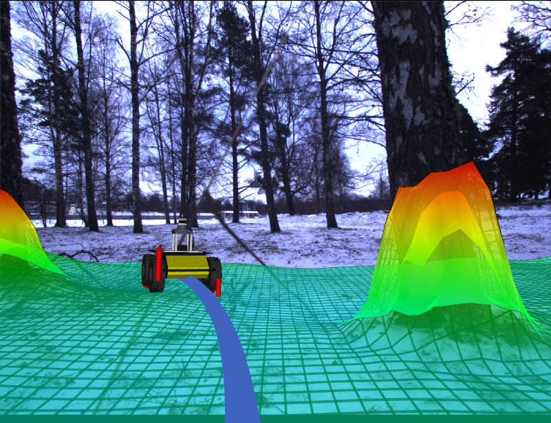
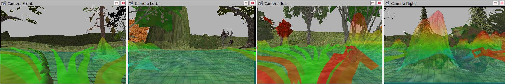

# MonoForce

[](https://arxiv.org/abs/2309.09007)
[](https://docs.google.com/presentation/d/1pJFHBYVeOULi-w19_mLEbDTqvvk6klcVrrYc796-2Hw/edit?usp=sharing)
[](https://drive.google.com/file/d/1tTt1Oi5k1jKPDYn3CnzArhV3NPSNxKvD/view?usp=sharing)
[](https://drive.google.com/drive/folders/1TdEUQ5m5la3Q8DCrRzxeDJKlrYyCMkb9?usp=sharing)




The three people are visible as the pillars within the blue area.

Robot-terrain interaction prediction from only RGB images as input.

   

## Table of Contents
- [Installation Instructions](./docs/INSTALL.md)
- [Data](./docs/DATA.md)
- [Terrain Encoder](./docs/TERRAIN_ENCODER.md)
- [Differentiable Physics](./docs/DPHYS.md)
- [Running](#running)
- [ROS Integration](#ros-integration)
- [Navigation](#navigation)
- [Citation](#citation)

## Running


The MonoForce pipeline consists of the Terrain Encoder and the Differentiable Physics modules.
Given input RGB images and cameras calibration the Terrain Encoder predicts robot's supporting terrain.
Then the Differentiable Physics module simulates robot trajectory and interaction forces on the predicted terrain
for a provided control sequence (linear and angular velocities).
Refer to the [examples](./examples) folder for implementation details.

Please run the following command to explore the MonoForce pipeline:
```commandline
python scripts/run --img-paths IMG1_PATH IMG2_PATH ... IMGN_PATH --cameras CAM1 CAM2 ... CAMN --calibration-path CALIB_PATH
```

For example if you want to test the model with the provided images from the RobinGas dataset:
```commandline
python scripts/run --img-paths config/data_sample/tradr/images/1666267171_394104004_camera_front.png \
                               config/data_sample/tradr/images/1666267171_394104004_camera_left.png \
                               config/data_sample/tradr/images/1666267171_394104004_camera_right.png \
                               config/data_sample/tradr/images/1666267171_394104004_camera_rear_left.png \
                               config/data_sample/tradr/images/1666267171_394104004_camera_rear_right.png \
                   --cameras camera_front camera_left camera_right camera_rear_left camera_rear_right \
                   --calibration-path config/data_sample/tradr/calibration/ \
                   --lss_cfg_path config/lss_cfg_tradr.yaml --model_path config/weights/lss/lss_robingas_tradr.pt --dphys_cfg_path config/dphys_cfg.yaml \
                   --linear-vel 0.5 --angular-vel -0.1
```
Please, refer to the [Terrain Encoder](./docs/TERRAIN_ENCODER.md) documentation to download the pretrained model weights.

If you have [ROS](http://wiki.ros.org/noetic/Installation/Ubuntu) and [Docker](https://docs.docker.com/engine/install/ubuntu/) installed you can also run:
```commandline
docker pull agishrus/monoforce
cd docker/
./run.sh
```


## ROS Integration

We provide a ROS nodes for both the trained Terrain Encoder model and the Differentiable Physics module.
They are integrated into the launch file:

```commandline
roslaunch monoforce monoforce.launch
```

## Navigation

Navigation method only using RGB images.
The package is used as robot-terrain interaction and path planning pipeline.




Trajectories prediction is based on the
[NVIDIA/warp](https://github.com/NVIDIA/warp) and
[ctu-vras/diffsim](https://github.com/ctu-vras/diffsim)
packages.
Take a look at the
[trajectory_shooting_with_warp_diff_physics.ipynb](./examples/trajectory_shooting_with_warp_diff_physics.ipynb)
notebook for the example of the trajectories prediction.

Navigation consists of the following stages, [video](https://drive.google.com/file/d/1OLnTtedNLX23HjNnXV7Sct_3xSFGxe2H/view?usp=sharing):
- **Height map prediction**: The Terrain Encoder part of the MonoForce is used to estimate terrain properties.
- **Trajectories prediction**: The Diff Physics part of the MonoForce is used to shoot the robot trajectories.
- **Trajectory selection**: The trajectory with the smallest cost based on robot-terrain interaction forces is selected.
- **Control**: The robot is controlled to follow the selected trajectory.

Please, refer to [ctu-vras/husky_nav](https://github.com/ctu-vras/husky_nav/tree/monoforce) package for the navigation example in
[Gazebo](http://gazebosim.org/) simulator.

## Citation

Consider citing the papers if you find the work relevant to your research:

```bibtex
@article{agishev2023monoforce,
    title={MonoForce: Self-supervised Learning of Physics-aware Model for Predicting Robot-terrain Interaction},
    author={Ruslan Agishev and Karel Zimmermann and Vladimír Kubelka and Martin Pecka and Tomáš Svoboda},
    year={2023},
    eprint={2309.09007},
    archivePrefix={arXiv},
    primaryClass={cs.RO},
    note={accepted to IROS2024}
    url={https://arxiv.org/abs/2309.09007}
}
```

```bibtex
@inproceedings{agishev2024endtoend,
    title={End-to-end Differentiable Model of Robot-terrain Interactions},
    author={Ruslan Agishev and Vladim{\'\i}r Kubelka and Martin Pecka and Tomas Svoboda and Karel Zimmermann},
    booktitle={ICML 2024 Workshop on Differentiable Almost Everything: Differentiable Relaxations, Algorithms, Operators, and Simulators},
    year={2024},
    url={https://openreview.net/forum?id=XuVysF8Aon}
}
```
