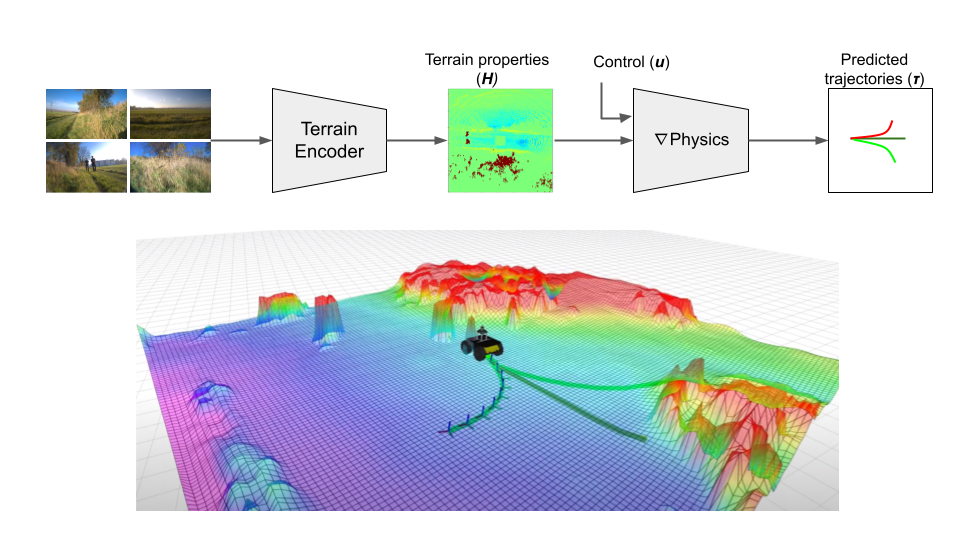
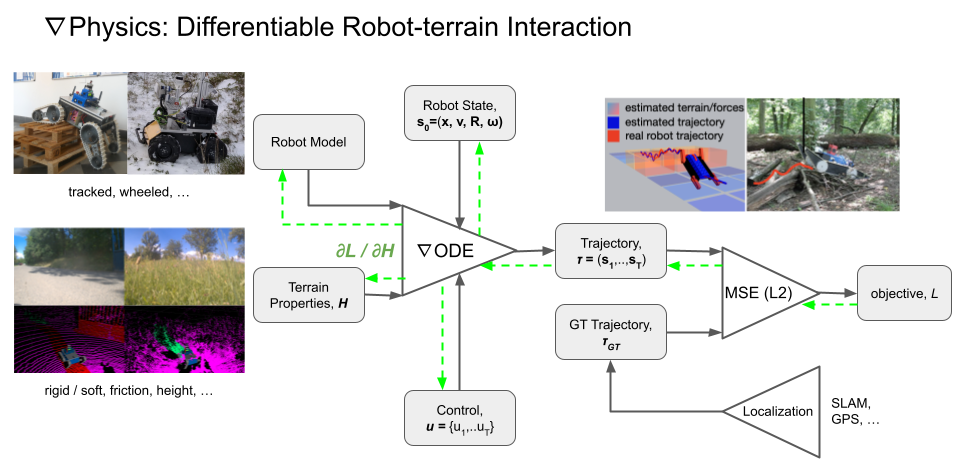
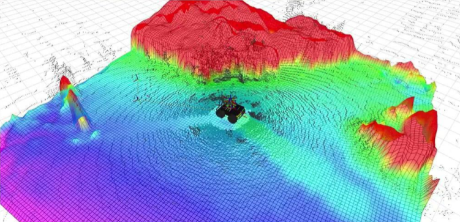
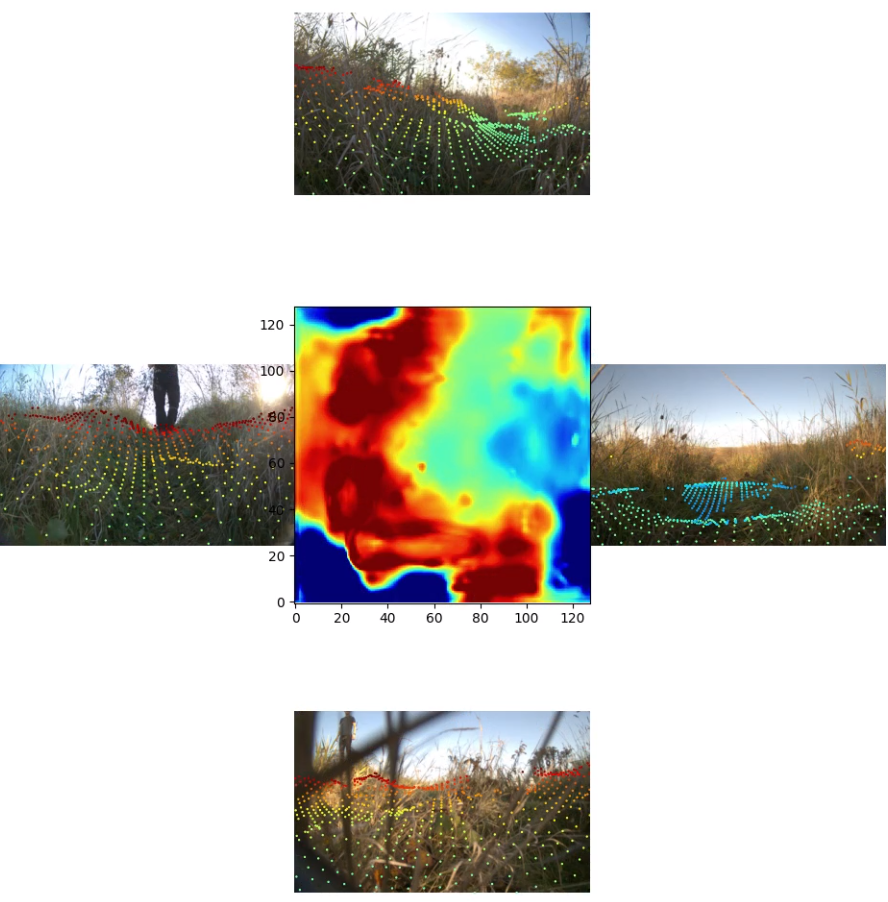
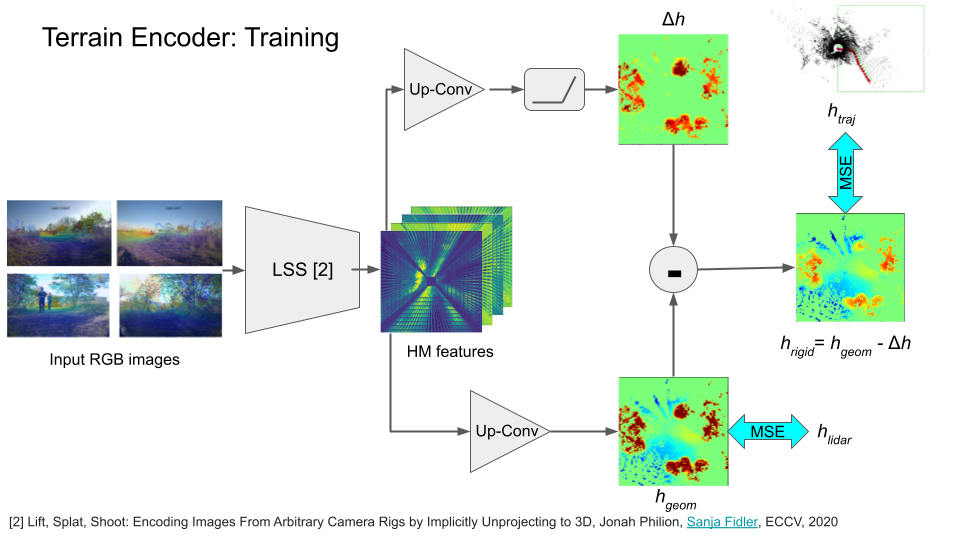

# MonoForce

[](https://arxiv.org/abs/2309.09007)
[](https://docs.google.com/presentation/d/1pJFHBYVeOULi-w19_mLEbDTqvvk6klcVrrYc796-2Hw/edit?usp=sharing)

Self-supervised learning of physics-aware grey-box model for predicting robot-terrain interaction.



## Installation
Please, follow the [INSTALL.md](./docs/INSTALL.md) for the installation instructions.

## Data

Traversability data structure and processing are described in the [DATA.md](./docs/DATA.md).

## Differentiable Physics


Run the differentiable physics simulation with a robot model and the provided dataset:
```commandline
python scripts/robot_control
```


Terrain properties optimization from the ground-truth trajectories followed by the robot:
```commandline
python scripts/fit_terrain
```

## Terrain Encoder

The Terrain Encoder is a model that predicts the shape of the supporting terrain from input RGB images.
The demo video is available via the [link](https://drive.google.com/file/d/17GtA_uLyQ2o3tHiBuhxenZ0En7SzLAad/view?usp=sharing).

 

### Training



1. Using the Differentiable Physics module, the terrain shape under the robot trajectory is optimized in order to match the ground-truth trajectory as closely as possible.
2. The optimized terrain shape is used as a label to train the terrain shape predictor. This model takes as input an RGB-image and predicts the shape of the supporting terrain in front of a robot.
We utilize the [Lift-Splat-Shoot (LSS)](https://github.com/nv-tlabs/lift-splat-shoot) model as the Terrain Encoder.
3. Lidar scans are used in order to provide initial height map estimates during training.

To train the LSS model, please run:
```commandline
cd scripts/
python train
```

### Data Sample

The LSS model training data example include:
- input RGB images,
- terrain heightmap estimated from lidar,
- robot footprint trajectory,
- point cloud generated from camera frustums.


## ROS Integration

We provide a ROS node that integrates the trained Terrain Encoder model with the Differentiable Physics module.
Given the input RGB images and cameras calibration, the Terrain Encoder predicts the terrain shape,
which is then used to simulate robot trajectories.

```commandline
roslaunch monoforce lss_demo.launch
```

## Citation

Consider citing the paper if you find it relevant to your research:

```bibtex
@article{agishev2023monoforce,
  title={MonoForce: Self-supervised learning of physics-aware grey-box model for predicting the robot-terrain interaction},
  author={Agishev, Ruslan and Zimmermann, Karel and Pecka, Martin and Svoboda, Tom{\'a}{\v{s}}},
  journal={arXiv preprint arXiv:2309.09007},
  year={2023}
}
```
