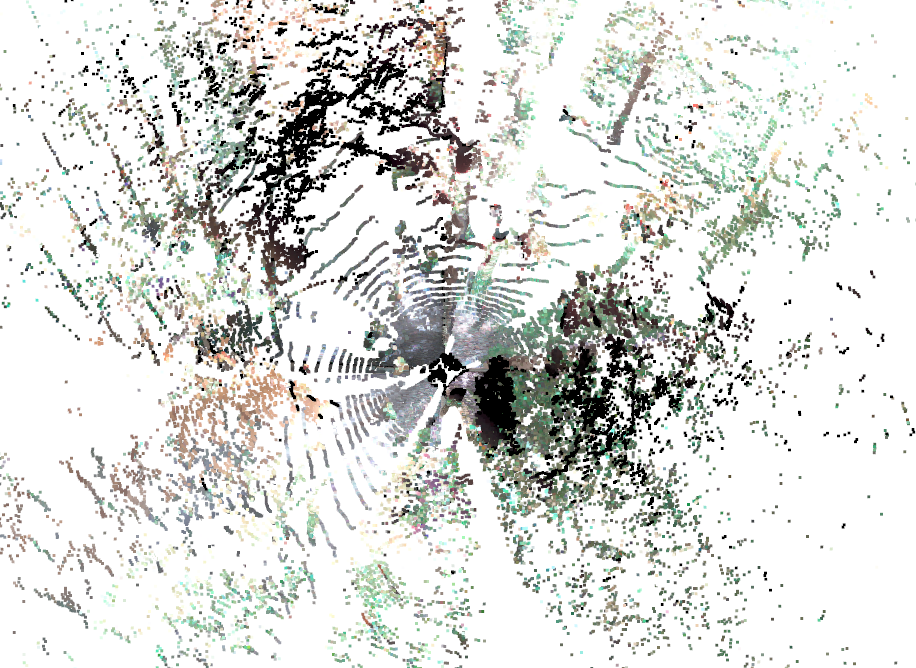

## Dataset
The data is available at 
[http://subtdata.felk.cvut.cz/robingas/data/](http://subtdata.felk.cvut.cz/robingas/data/).

Self-supervised traversability data generated using lidar SLAM.
- The dataset contains:
  - point clouds, 
  - camera images,
  - calibration data: camera-lidar extrinsics, camera intrinsics, and distortion parameters,
  - localization data: robot poses for each point cloud stamp,
  - robot's future trajectories data (10 seconds long).

The traversability dataset has the following structure:
```commandline
<experiment-date-place>
└── <robot name>
    └── <sequence name>
        ├── calibration
        │   ├── cameras
        │   ├── img_statistics.yaml
        |   └── transformations.yaml
        ├── clouds
        ├── images
        ├── poses
        ├── terrain
        │   ├── lidar
        │   └── traj
        ├── trajectories
        └── visuals
```
Folder names example:
[22-10-27-unhost-final-demo/husky_2022-10-27-15-33-57/](http://subtdata.felk.cvut.cz/robingas/data/22-10-27-unhost-final-demo/husky_2022-10-27-15-33-57/).
One can download a sequence folder by running:
```commandline
scp -r <username>@subtdata.felk.cvut.cz:/data/robingas/data/<experiment-date-place>/<robot-name>/<sequence-name> .
```

The point clouds (located in the `clouds` folder) are segmented by the robot's footprint trajectory.
Please have a look at the
[video](https://drive.google.com/file/d/1CmLwgTUFmKrMXm5hG5n1Bz0XBZqLNifc/view?usp=drive_link)
for the data preview from a sequence recorded with the tracked robot in a forest environment.

In order to generate the traversability data from a prerecorded bag file, please run
(*note, that the topic names could be different depending on a bag file):
```commandline
cd ./scripts/data/
./save_sensor_data --bag-paths /path/to/dataset/<experiment-date-place>/<robot-name>/<sequence-name>.bag \
                               /path/to/dataset/<experiment-date-place>/<robot-name>/<sequence-name>_loc.bag \
                               --cloud-topics /os_cloud_node/destaggered_points \
                               --camera-topics /camera_rear/image_color/compressed \
                                               /camera_front/image_color/compressed \
                                               /camera_right/image_color/compressed \
                                               /camera_left/image_color/compressed \
                               --camera-info-topics /camera_front/camera_info \
                                                    /camera_rear/camera_info \
                                                    /camera_right/camera_info \
                                                    /camera_left/camera_info \
                               --robot-model 'Box()' --discard-model 'Box()' \
                               --input-step 50 --visualize False --save-data True
```

Camera views examples:

Colored point cloud            |            Front-facing camera            |        Up-facing camera        
:-----------------------------:|:-----------------------------------------:|:------------------------------:
 |  | 

To explore the data, please run:
```commandline
python -m monoforce.datasets.robingas
```
