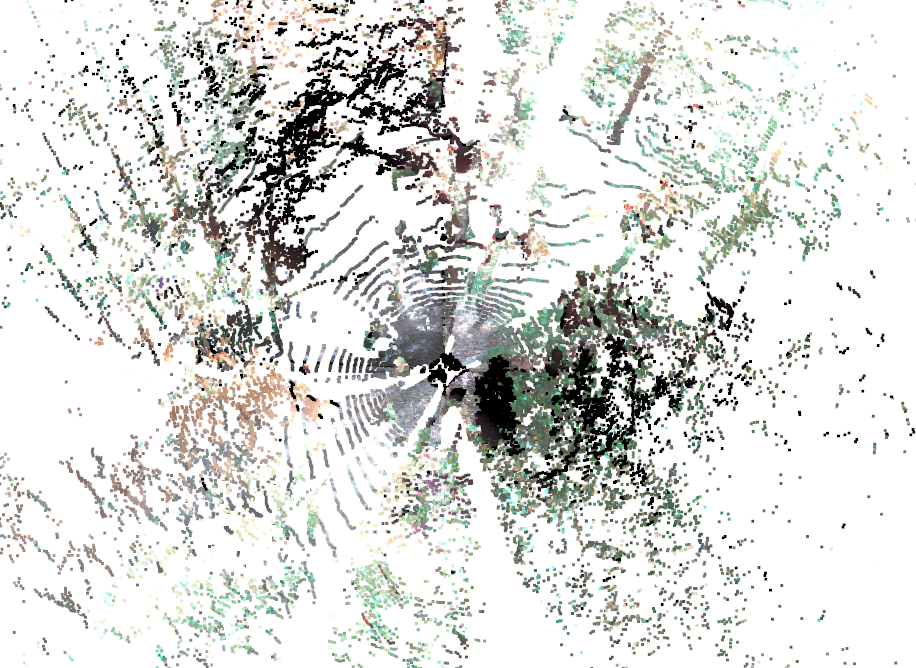
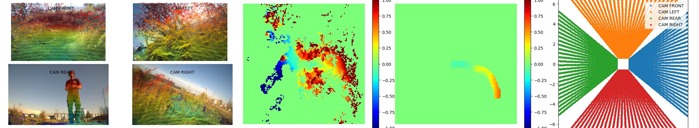

## Traversability Data Structure and Processing

> [!IMPORTANT]
> Please note that the dataset is under construction and is being updated.
> More information is available at [ctu-vras/rough-dataset](https://github.com/ctu-vras/rough-dataset).
> This page contains a description of the dataset preliminary version.

Self-supervised traversability data generated using [lidar SLAM](https://github.com/norlab-ulaval/norlab_icp_mapper).
The data sequences are available at Google Drive:
- [ROUGH](https://drive.google.com/drive/folders/1nli-4YExqcBhl0mPNRUjSiNecX4yIcme?usp=sharing).
- [RobInGas](https://drive.google.com/drive/folders/1UoNd5R6R75pBE1n8ztzUzOGsG3FBBHFU?usp=sharing)

The data sequences can be downloaded for example using [gdown](https://github.com/wkentaro/gdown):
```bash
pip install gdown
gdown URL --folder --remaining-ok
```

The dataset contains:
  - point clouds, 
  - camera images,
  - calibration data: camera-lidar extrinsics, camera intrinsics, and distortion parameters,
  - localization data: robot poses for each point cloud stamp,

The traversability dataset has the following structure:
```commandline
<sequence name>
    ├── calibration
    │   ├── cameras
    │   ├── img_statistics.yaml
    |   └── transformations.yaml
    ├── clouds
    ├── images
    ├── poses
    ├── terrain
    │   ├── lidar
    │   └── traj
    └── visuals
```

The point clouds (located in the `clouds` folder) are segmented by the robot's footprint trajectory.
Please have a look at the
[video](https://drive.google.com/file/d/1CmLwgTUFmKrMXm5hG5n1Bz0XBZqLNifc/view?usp=drive_link)
for the data preview from a sequence recorded with the tracked robot in a forest environment.

Camera views examples:

Colored point cloud            |            Front-facing camera            |        Up-facing camera        
:-----------------------------:|:-----------------------------------------:|:------------------------------:
 |  | 


### Data Sample

The [Terrain Encoder](./TERRAIN_ENCODER.md) model training data example include:
- input RGB images,
- terrain heightmap estimated from lidar,
- robot footprint trajectory,
- point cloud generated from camera frustums.


