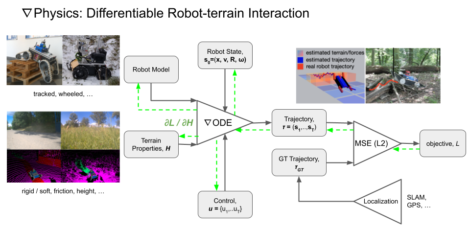

## Differentiable Physics


Run the differentiable physics simulation with a robot model and the provided dataset:
```commandline
python scripts/robot_control.py
```


Terrain properties optimization from the ground-truth trajectories followed by the robot:
```commandline
python scripts/fit_terrain.py
```


