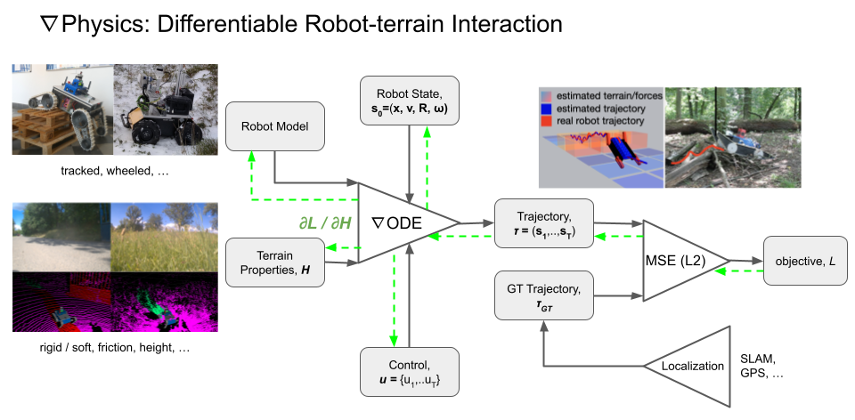

## Differentiable Physics Engine

The differentiable physics engine is a simulation environment
that allows for the simulation of robot dynamics and terrain interaction.
The engine is designed in a differentiable way and implemented in [Pytorch](https://pytorch.org/).
That means that it is possible to compute gradients with respect to its interfaces.

Run the physics simulation with a tracked robot model with moving flippers:
```commandline
python monoforce/scripts/run_physics_engine.py
```


