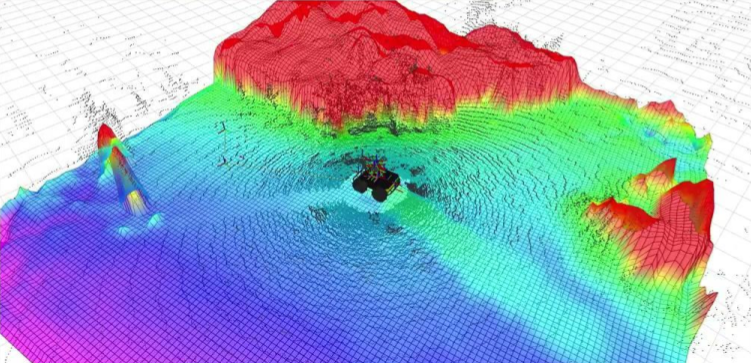
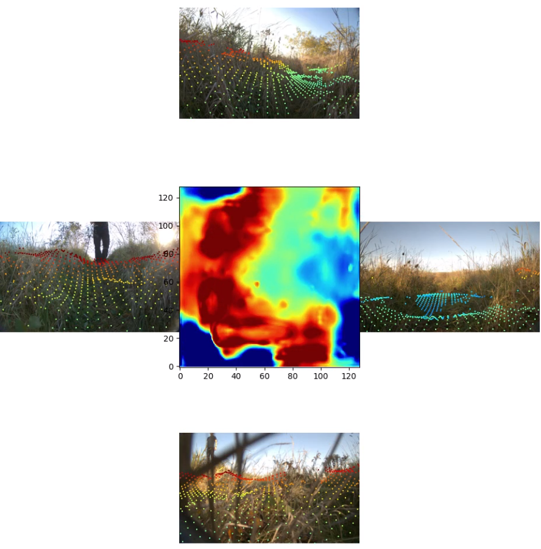
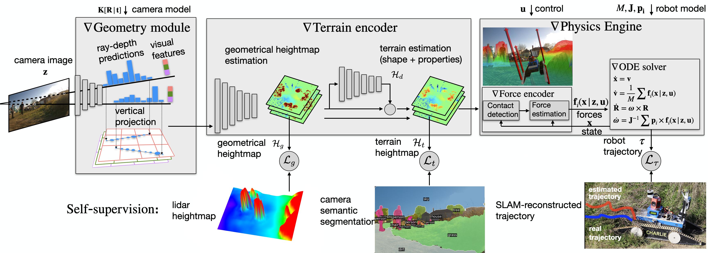

## Terrain Encoder

The Terrain Encoder is a model that predicts robot's supporting terrain from input RGB images,
[video](https://drive.google.com/file/d/17GtA_uLyQ2o3tHiBuhxenZ0En7SzLAad/view?usp=sharing).

 

### Training



1. Using the Differentiable Physics module, the terrain shape under the robot trajectory is optimized in order to match the ground-truth trajectory as closely as possible.
2. The optimized terrain shape is used as a label to train the terrain shape predictor. This model takes as input an RGB-image and predicts the shape of the supporting terrain in front of a robot.
We utilize the [Lift-Splat-Shoot (LSS)](https://github.com/nv-tlabs/lift-splat-shoot) model as the Terrain Encoder.
3. Lidar scans are used in order to provide initial height map estimates during training.

To train the LSS model, please run:
```commandline
cd scripts/
python train.py
```
